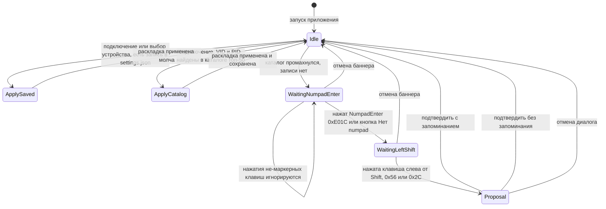

# План v1.2.0 — Автоматическое определение типа клавиатуры

## Цель

При подключении клавиатуры автоматически определять раскладку:

1. **Каталог VID/PID** — поиск по встроенной базе топ-50 популярных клавиатур (Logitech, Razer, Corsair, Keychron, Ducky, Varmilo, Leopold и др.).
2. **Маркерная эвристика** — если каталог не сработал: подсказка «Нажмите Enter на цифровом блоке (если есть) и клавишу слева от левого Shift», сбор маркеров.
3. **Предложение с ручным выбором** — после нажатий применить эвристику и предложить раскладку, пользователь может изменить.
4. **Персистентность** — выбор сохраняется в `settings.json`, ключ привязки **`VID_XXXX&PID_YYYY`** (извлечён из DevicePath; стабилен для USB/Bluetooth, переживает смену порта). Для устройств без VID/PID (ноутбучные ACPI/PS-2, где `ParseVidPid` даёт `0/0`) — fallback-ключ = полный `DevicePath`.

## Зафиксированные решения

| Вопрос | Решение |
|---|---|
| Ключ привязки | `VID_XXXX&PID_YYYY`; fallback `DevicePath` при нулевом VID/PID |
| Поведение при выборе устройства | Сохранённая раскладка применяется автоматически; ручная смена раскладки при выбранном устройстве обновляет привязку |
| Попадание в каталог | Раскладка применяется и привязка сохраняется молча (без вопроса) |
| Отмена визарда | Баннер закрывается, при следующем подключении спросит снова |
| Определение раскладки «на лету» | Существующий `ILayoutProvider.DetectLayout` не трогаем — он требует полного покрытия; новая маркерная эвристика работает по 2 маркерам |

## На что опираемся (уже есть в коде)

- [`InputDevice`](../src/KeyboardTester.Core/Models/InputDevice.cs) уже несёт `DevicePath`, `VendorId`, `ProductId`, `ConnectionType` — VID/PID парсится в [`ParseVidPid()`](../src/KeyboardTester.Infrastructure/Input/RawInputCapture.cs).
- [`BuildScanCode()`](../src/KeyboardTester.Infrastructure/Input/RawInputCapture.cs) кодирует E0-флаг в скан-код (`0xE000u`) → **Numpad Enter = `0xE01C`** отличим от основного Enter (`0x1C`). P/Invoke не трогаем.
- [`IRawInputCapture`](../src/KeyboardTester.Core/Interfaces/IRawInputCapture.cs) даёт `DeviceConnected`, `KeyPressed`, `SelectDevice`, `RefreshDevices`.
- Паттерн «VM запрашивает диалог событием» (`OpenSettingsRequested`) — переиспользуем для диалога предложения.

## Поток детекции



### Матрица маркерной эвристики

Клавиша слева от левого Shift: на ISO между `Z` и Shift есть дополнительная клавиша `OEM_102` (скан `0x56`); на ANSI слева от Shift стоит `Z` (скан `0x2C`).

| NumpadEnter `0xE01C` | Слева от Shift | Предложение |
|---|---|---|
| нажат | `0x56` | `Iso105` |
| нажат | `0x2C` | `Ansi104` |
| «нет numpad» | `0x56` | нет уверенного варианта — диалог с ручным выбором |
| «нет numpad» | `0x2C` | неоднозначно 60/75/TKL — диалог с ручным выбором |
| — | — (неполные данные) | визард ждёт дальше |

Если видны оба маркера `0x56` и `0x2C` — приоритет у `0x56` (однозначное доказательство ISO).

## Изменения по слоям

### 1. Core — модели и интерфейсы (без зависимостей)

Новые файлы:

- `Models/KnownKeyboard.cs` — record `KnownKeyboard(uint VendorId, uint ProductId, string Brand, string Model, KeyboardLayout Layout)`.
- `Interfaces/IKeyboardCatalog.cs` — `KnownKeyboard? FindByVidPid(uint vendorId, uint productId)` + `IReadOnlyList<KnownKeyboard> All`.
- `Dto/LayoutMarkers.cs` — record: `bool NumpadEnterPressed`, `bool NumpadMarkedAbsent`, `uint? KeyLeftOfLeftShiftScanCode`.
- `Interfaces/ILayoutHeuristics.cs` — `KeyboardLayout? SuggestLayout(LayoutMarkers markers)`; возвращает null при неуверенности.
- `Interfaces/IDeviceLayoutStore.cs` — `KeyboardLayout? GetSavedLayout(string deviceKey)`, `void SaveLayout(string deviceKey, KeyboardLayout layout)`.
- `Models/InputDeviceExtensions.cs` (или статический хелпер `KeyboardDeviceKey`) — `string GetLayoutBindingKey(this InputDevice device)`: `VID_{VendorId:X4}&PID_{ProductId:X4}` при ненулевых VID/PID, иначе `DevicePath`.

### 2. Infrastructure — каталог и эвристика

Новые файлы:

- `Layouts/KeyboardCatalog.cs` — реализация `IKeyboardCatalog`. Статический встроенный массив ~50 записей (стиль как у `LayoutProvider` — код-данные, тестируемо, без I/O). Источник VID/PID при реализации: реестр VID usb.org + спецификации производителей. Ориентир по брендам и VID:
  - Logitech `046D` (G Pro, G Pro X, G915, G815, K845…)
  - Razer `1532` (Huntsman, Huntsman Mini, BlackWidow V3/V4, DeathStalker…)
  - Corsair `1B1C` (K70, K95, K100, K65 Mini…)
  - SteelSeries `1038`, HyperX `03F0`/`25A7`, Cherry `046A` 
  - Keychron `34EA` (K2, K6, K8, Q1, Q3, V1…), Ducky `04D9`/`1EA7` (One 2, One 3), Varmilo `056E`/`3554`, Leopold `77D4`? — **точные PID проверять по usb.ids и Device Manager при реализации**; в базу заносить только проверенные пары.
  - Akko, Royal Kludge, Anne Pro (Obins `05AC`? — проверить), NuPhy, Glorious `05AC`? (проверить), Filco.
  - Каждой модели — типовая раскладка (например, Keychron K2 US-ANSI → `Layout75`-класс... маппинг на наш enum: TKL/60/75/full — по физическому форм-фактору модели).
- `Layouts/LayoutHeuristics.cs` — реализация `ILayoutHeuristics` по матрице выше. Константы: `NumpadEnterScanCode = 0xE01C`, `IsoLeftShiftNeighborScanCode = 0x56`, `AnsiLeftShiftNeighborScanCode = 0x2C`, `LeftShiftScanCode = 0x2A`.

### 3. Application — оркестрация детекции

Новые файлы:

- `Services/KeyboardDetectionService.cs` — конечный автомат (см. диаграмму):
  - `Start(InputDevice target)`, `Cancel()`, `MarkNumpadAbsent()`, `HandleKeyPress(RawKeyEventArgs e)`, `Confirm(KeyboardLayout layout, bool remember)`.
  - Свойство `Target`, enum-состояние, события `StateChanged`, `ProposalReady`.
  - Фильтрация `HandleKeyPress` по `e.DevicePath == Target.DevicePath`.
  - Захват маркеров: `0xE01C` → NumpadEnter; `0x56`/`0x2C` → сосед Shift (оба сохраняются, приоритет `0x56`).
- Регистрация в `ServiceCollectionExtensions.AddKeyboardTesterApplication()`.

Изменения в `ViewModels/MainViewModel.cs`:

- Новые observable-свойства: `IsDetectionActive`, `DetectionWaitingNumpadEnter`, `DetectionWaitingLeftShift`, `NumpadEnterDetected`, `LeftShiftKeyDetected`, `IsProposalRequired`, `SuggestedLayout`, `ProposedLayout` (выбранная в диалоге), `RememberDeviceLayout`, `DetectedKeyboardName` (статус при попадании в каталог).
- Новые команды: `SkipNumpadCommand` («Нет numpad»), `CancelDetectionCommand`, `ApplyProposedLayoutCommand`, `CancelProposalCommand`, `RunDetectionCommand` (кнопка «Определить автоматически» рядом с комбобоксом раскладки — ручной повторный запуск).
- Событие `ProposalRequested` — MainWindow открывает `LayoutProposalDialog` (паттерн `OpenSettingsRequested`).
- Логика `TryApplyLayoutForDevice(InputDevice device)` — вызывается из `OnDeviceConnected` и `OnSelectedKeyboardChanged`:
  1. `IDeviceLayoutStore.GetSavedLayout(key)` → применить молча;
  2. `IKeyboardCatalog.FindByVidPid` → применить, сохранить привязку, показать имя в статусе;
  3. иначе `_detectionService.Start(device)` → баннер.
- `OnKeyPressed` → прокинуть в `_detectionService.HandleKeyPress(e)` при активной детекции.
- Флаг `_isApplyingLayout` для различия программного применения и ручной смены: ручная смена при активном визарде отменяет визард; ручная смена при выбранном устройстве обновляет привязку в сторе.
- `EnsureCaptureStarted()`/`MaybeStopCapture()`: захват должен работать во время детекции (`|| IsDetectionActive` в условии остановки).

### 4. UI — баннер, диалог, настройки, локализация

- `Services/SettingsService.cs`:
  - `AppSettings` + `Dictionary<string, KeyboardLayout> DeviceLayouts { get; set; } = new();`
  - Реализует `IDeviceLayoutStore` (интерфейс Core): `GetSavedLayout`/`SaveLayout` мутируют `Current` и перезаписывают файл.
  - **Регресс-защита**: `Save(debounce, theme)` из SettingsDialog сегодня пересоздаёт `AppSettings` — добавить сохранение `DeviceLayouts` (merge), иначе диалог настроек стёр бы привязки.
- `Views/MainWindow.xaml`: строка-баннер между ToolBar и контентом:
  - текст подсказки «Нажмите Enter на цифровом блоке (если есть) и клавишу слева от левого Shift»;
  - два индикатора прогресса (галочки по `NumpadEnterDetected`/`LeftShiftKeyDetected`);
  - кнопки «Нет цифрового блока» и «Отмена»;
  - видимость через `BoolToVisibilityConverter` по `IsDetectionActive`.
  - Кнопка «Определить автоматически» (`RunDetectionCommand`) рядом с комбобоксом раскладки в тулбаре.
- `Views/MainWindow.xaml.cs`: подписка на `MainViewModel.ProposalRequested` → `LayoutProposalDialog` (владелец — окно, `ShowDialog`); результат — через команды VM.
- Новый `Views/LayoutProposalDialog.xaml(.cs)`: заголовок «Определение раскладки», текст предложения («Предлагаемая раскладка: ISO 105»), комбобокс всех раскладок (предварительно выбрана `SuggestedLayout`, при null — текущая), чекбокс «Запомнить для этой клавиатуры» (включён по умолчанию), кнопки ОК/Отмена. Стили — `DynamicResource` из `Resources/Styles.xaml`, переживающие смену темы.
- `Resources/Strings.resx` + `Strings.Designer.cs` (~12 ключей): DetectionHintTitle, DetectionHintText, DetectionNoNumpad, DetectionCancel, DetectionNumpadEnterDone, DetectionLeftShiftDone, LayoutProposalTitle, LayoutProposalSuggested, LayoutProposalRemember, AutoDetectLayout, KeyboardRecognized, KeyboardUnknown и пр.

### 5. DI-композиция (`App.xaml.cs`)

```csharp
services.AddSingleton<IKeyboardCatalog, KeyboardCatalog>();
services.AddSingleton<ILayoutHeuristics, LayoutHeuristics>();
services.AddSingleton<IDeviceLayoutStore>(sp => sp.GetRequiredService<SettingsService>());
// KeyboardDetectionService — внутри AddKeyboardTesterApplication()
```

### 6. Тесты

Core.Tests (чистая логика):

- `Layouts/KeyboardCatalogTests.cs`: точное попадание возвращает модель+раскладку; промах → null; целостность базы (≥50 записей, уникальность VID/PID, корректные enum-значения, форм-фактор соответствует модели).
- `Layouts/LayoutHeuristicsTests.cs`: матрица (numpad+0x56→Iso105; numpad+0x2C→Ansi104; нет-numpad→null; неполные маркеры→null; оба соседа→приоритет 0x56).

Integration.Tests (все проекты, STA где нужно):

- `Services/KeyboardDetectionServiceTests.cs`: переходы состояний, фильтр по DevicePath, «Нет numpad», отмена, Confirm.
- `Detection/MainViewModelDetectionTests.cs` (через `FakeRawInputCapture`): подключение неизвестного устройства → баннер; маркерные нажатия → состояние предложения с эвристикой; `ApplyProposedLayout(remember: true)` → привязка в сторе; повторное подключение → автоприменение без визарда; попадание в каталог → автоприменение; ручная смена раскладки обновляет привязку.
- `Services/DeviceLayoutStoreTests.cs`: roundtrip `SettingsService` во временном каталоге; формат ключа `VID_046D&PID_C339`; **регресс**: `Save(debounce, theme)` не стирает `DeviceLayouts`; повреждённый settings.json → дефолты.

### 7. Релиз

- `Directory.Build.props`: `<Version>1.2.0</Version>`.
- `KeyboardTesterDevelopPlan.md`: раздел v1.2.0 с требованиями и статусом.
- `Release 1.2.0.md`: changelog со списком файлов.
- `README.md`: раздел про автодетект (и убрать упоминания PDF, если остались).

## Риски и их закрытие

| Риск | Митигция |
|---|---|
| Неточные VID/PID в каталоге | Заносить только проверенные пары (usb.org, Device Manager); ошибка каталога не фатальна — пользователь меняет раскладку вручную, привязка обновляется |
| `0x2C` (Z) неоднозначен | Явная инструкция в подсказке; приоритет `0x56`; диалог всегда допускает ручной выбор |
| Захват не запущен вне сессии | Расширить `MaybeStopCapture` условием `IsDetectionActive`; `EnsureCaptureStarted` при старте визарда |
| SettingsDialog стирает привязки | Merge в `Save()` + регресс-тест |
| Клавиатуры без VID/PID (ноутбучные) | Fallback-ключ `DevicePath`; каталог для них пропускается |
| Несколько клавиатур одновременно | Визард привязан к `SelectedKeyboard`; маркеры фильтруются по `DevicePath` цели |

## Порядок реализации

1. Core: модели, DTO, интерфейсы, хелпер ключа.
2. Infrastructure: `KeyboardCatalog` (база топ-50), `LayoutHeuristics`.
3. UI: расширение `SettingsService` (+merge-защита), реализация `IDeviceLayoutStore`.
4. Application: `KeyboardDetectionService`.
5. Application: `MainViewModel` (состояния, команды, автоприменение, захват).
6. UI: баннер, `LayoutProposalDialog`, кнопка в тулбаре, локализация.
7. DI-регистрация, сборка без warning'ов.
8. Тесты (Core + Integration), `dotnet test` зелёный.
9. Релизная документация и версия 1.2.0.
